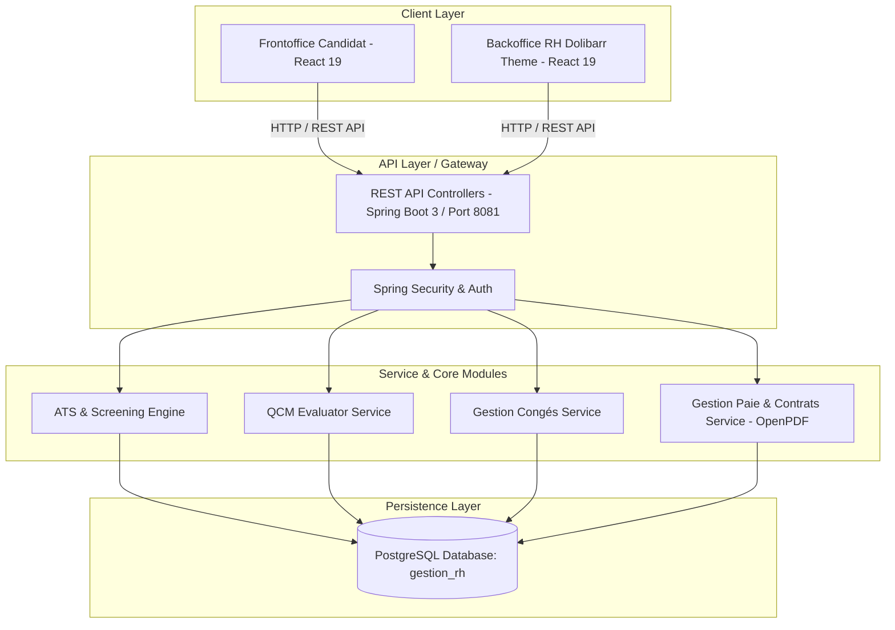

# 🏢 Suite ERP RH & Recrutement ATS (Gestion-RH)

[](https://www.oracle.com/java/)
[](https://spring.io/projects/spring-boot)
[](https://react.dev/)
[](https://vitejs.dev/)
[](https://www.postgresql.org/)
[](LICENSE)

> **Solution Fullstack Enterprise de Gestion des Ressources Humaines, Paie & Système ATS (Applicant Tracking System).**  
> Allie un **Backoffice RH (thème ERP Dolibarr)** complet et un **Frontoffice Candidat** ergonomique pour automatiser l'intégralité du cycle de recrutement, l'évaluation QCM, la gestion des congés, la paie/bulletins de salaire et la génération automatisée des contrats de travail.

---

## 📌 Sommaire

- [✨ Fonctionnalités Clés](#-fonctionnalités-clés)
- [🏗️ Architecture du Système](#️-architecture-du-système)
- [🛠️ Stack Technique](#️-stack-technique)
- [🚀 Guide d'Installation](#-guide-dinstallation)
  - [Prérequis](#1-prérequis)
  - [Base de Données](#2-base-de-données-postgresql)
  - [Backend (Spring Boot)](#3-backend-spring-boot)
  - [Frontend (React + Vite)](#4-frontend-react--vite)
- [📄 Documentation des API (Swagger)](#-documentation-des-api-swagger)
- [📂 Structure du Projet](#-structure-du-projet)
- [🤝 Contribution & Licence](#-contribution--licence)

---

## ✨ Fonctionnalités Clés

### 🎯 1. Module Recrutement & ATS (Applicant Tracking System)
* **Portail Candidat Public (Frontoffice)** : Consultation des offres d'emploi, dépôt de candidature en ligne avec CV et réponse aux formulaires dynamiques de critères.
* **Tableau de Bord Kanban RH** : Suivi des candidatures par statut (*Nouveau, Sélectionné, En Test, En Entretien, Retenu, Rejeté*).
* **Moteur de Screening Multicritères** : Calcul automatique de scores basé sur le diplôme, l'expérience, le salaire exigé et les exigences du poste.
* **Évaluations & Tests QCM** : Création d'épreuves personnalisées avec calcul automatique des notes et d'admissibilité.
* **Planning d'Entretiens** : Organisation des rendez-vous, attribution des évaluateurs et grilles d'évaluation.

### 🌴 2. Module Gestion des Congés & Absences
* **Demandes & Validation** : Circuit d'approbation des demandes de congés avec historique détaillé.
* **Gestion des Soldes** : Suivi et mise à jour en temps réel des soldes de congés payés par employé.
* **Jours Fériés & Calendrier** : Prise en compte des jours fériés et calcul précis des jours ouvrés.
* **Génération PDF** : Exportation des pièces justificatives et formulaires de congé en PDF (OpenPDF).

### 💰 3. Module Paie & Administration du Personnel
* **Bulletins de Paie** : Calcul de la paie, gestion des lignes de bulletin et des cotisations.
* **Feuilles de Temps (Time tracking)** : Suivi du temps de travail et heures effectuées.
* **Génération de Contrats** : Édition instantanée des contrats de travail (PDF) personnalisés selon les informations candidat/employé.
* **Gestion des Employés & Département** : Annuaire des employés, gestion des rôles, profils et diplômes.

---

## 🏗️ Architecture du Système



---

## 🛠️ Stack Technique

### **Frontend**
* **Framework** : React 19 & Vite 8
* **Routing** : React Router DOM v7
* **Client HTTP** : Axios
* **Utilitaires** : JSZip, PapaParse
* **UI/UX Design System** : Vanilla CSS (Inspiré du thème ERP Dolibarr, responsive, composants épurés)

### **Backend**
* **Langage & Framework** : Java 17 & Spring Boot 3
* **Persistance** : Spring Data JPA / Hibernate
* **Sécurité** : Spring Security
* **Génération PDF** : OpenPDF (LibrePDF)
* **Documentation API** : SpringDoc OpenAPI 2.5 (Swagger UI)
* **Boilerplate** : Lombok

### **Base de Données**
* **SGBD** : PostgreSQL 15+ (`gestion_rh`)

---

## 🚀 Guide d'Installation

### 1. Prérequis
Assurez-vous de disposer de :
* **Java SDK 17+** (`java -version`)
* **Node.js 18+** & **npm 9+** (`node -v`, `npm -v`)
* **PostgreSQL 15+** (`psql --version`)

---

### 2. Base de Données PostgreSQL

1. Créez la base de données dans PostgreSQL :
   ```sql
   CREATE DATABASE gestion_rh;
   ```
2. Exécutez les scripts SQL d'initialisation situés dans `database/` :
   ```bash
   psql -U postgres -d gestion_rh -f database/22-07-Recrutement.sql
   psql -U postgres -d gestion_rh -f database/22-07-DonneeRecrutement.sql
   psql -U postgres -d gestion_rh -f database/22-07-DonneeTestRecrutement.sql
   psql -U postgres -d gestion_rh -f database/04-08-Conge.sql
   psql -U postgres -d gestion_rh -f database/04-08-DonneeConge.sql
   psql -U postgres -d gestion_rh -f database/09-08-Paie.sql
   psql -U postgres -d gestion_rh -f database/09-08-DonneePaie.sql
   ```

---

### 3. Backend (Spring Boot)

1. Rendez-vous dans le dossier `backend` :
   ```bash
   cd backend
   ```
2. Vérifiez la configuration de la base dans `src/main/resources/application.properties` :
   ```properties
   spring.datasource.url=jdbc:postgresql://localhost:5432/gestion_rh
   spring.datasource.username=postgres
   spring.datasource.password=votre_mot_de_passe
   server.port=8081
   ```
3. Démarrez le backend :
   ```bash
   ./mvnw spring-boot:run
   ```
   *Le serveur s'exécute sur `http://localhost:8081`*

---

### 4. Frontend (React + Vite)

1. Rendez-vous dans le dossier `frontend` :
   ```bash
   cd frontend
   ```
2. Installez les dépendances :
   ```bash
   npm install
   ```
3. Démarrez le serveur Web :
   ```bash
   npm run dev
   ```
   *L'application est accessible sur `http://localhost:5173`*

---

## 📄 Documentation des API (Swagger)

L'API Spring Boot intègre la documentation interactive Swagger UI. Une fois le backend lancé sur le port 8081, accédez à :  
👉 **`http://localhost:8081/swagger-ui.html`**

---

## 📂 Structure du Projet

```text
Gestion-RH/
├── 📁 backend/                # API REST Spring Boot 3 (Port 8081)
│   ├── src/main/java/         # Controllers, Services, Repositories, Entities (ATS, Congés, Paie)
│   └── src/main/resources/    # Configuration application.properties & uploads
├── 📁 frontend/               # Application Web React 19 + Vite
│   ├── src/pages/backoffice/  # Dashboard RH, Annonces, Candidats, QCM, Congés, Paie
│   ├── src/pages/frontoffice/ # Espace Public Candidats
│   └── src/styles/            # Thème Dolibarr CSS
├── 📁 database/               # Scripts SQL (Recrutement, Congés, Paie)
└── 📁 documentation/          # Documentation détaillée par page (.md)
```

---

## 🤝 Contribution & Licence

Les contributions sont les bienvenues ! Pour toute amélioration, veuillez ouvrir une issue ou une Pull Request.

Distribué sous la licence **MIT**. Voir [LICENSE](LICENSE) pour plus d'informations.

---

<p align="center">
  Fait avec ❤️ par <b>Mikajy</b> — Développeur Fullstack
</p>