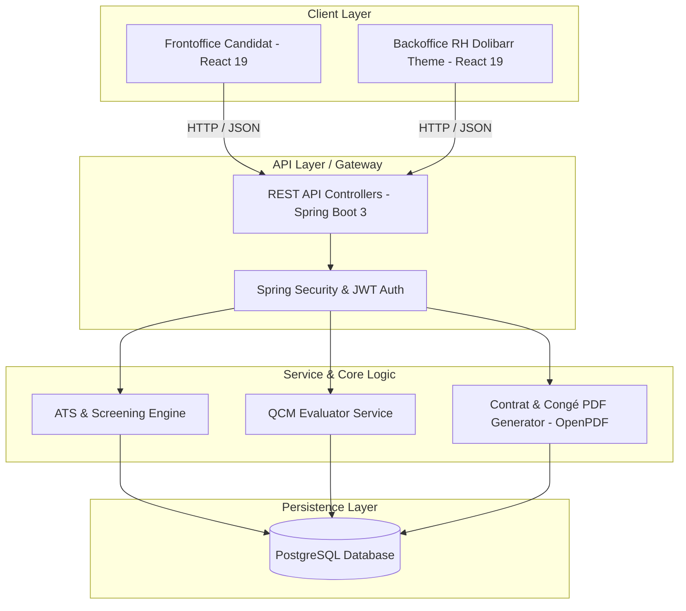

# 🏢 Suite RH & Recrutement ATS (Gestion-RH)

[](https://www.oracle.com/java/)
[](https://spring.io/projects/spring-boot)
[](https://react.dev/)
[](https://vitejs.dev/)
[](https://www.postgresql.org/)
[](LICENSE)

> **Solution Fullstack Enterprise de Gestion des Ressources Humaines & Système d'Acheminement des Candidatures (ATS).**  
> Allie un **Backoffice RH (style ERP Dolibarr)** puissant et un **Frontoffice Candidat** ergonomique pour automatiser l'intégralité du cycle de recrutement, des évaluations QCM, de la gestion des congés et de la génération automatisée des contrats de travail.

---

## 📌 Sommaire

- [✨ Fonctionnalités Clés](#-fonctionnalités-clés)
- [🏗️ Architecture du Système](#️-architecture-du-système)
- [🛠️ Stack Technique](#️-stack-technique)
- [🚀 Guide d'Installation](#-guide-dinstallation)
  - [Prérequis](#1-prérequis)
  - [Base de Données](#2-base-de-données-postgresql)
  - [Backend (Spring Boot)](#3-backend-spring-boot)
  - [Frontend (React + Vite)](#4-frontend-react--vite)
- [📄 Documentation des API (Swagger)](#-documentation-des-api-swagger)
- [📂 Structure du Projet](#-structure-du-projet)
- [🤝 Contribution & Licence](#-contribution--licence)

---

## ✨ Fonctionnalités Clés

### 🎯 1. Module Recrutement & ATS (Applicant Tracking System)
* **Portail Candidat Public (Frontoffice)** : Consultation fluide des offres d'emploi, dépôts de candidatures avec téléversement de CV et questionnaires dynamiques d'exigences.
* **Tableau de Bord Kanban RH** : Suivi visuel des étapes de recrutement (*Nouveau, Sélectionné, En Test, En Entretien, Retenu, Rejeté*).
* **Filtrage Multicritère Dynamique** : Moteur de scoring automatique pondérant les diplômes, l'expérience, le salaire exigé et la localisation.
* **Évaluations & Tests QCM** : Création d'épreuves personnalisées avec calcul automatique de la note et des seuils d'admissibilité.
* **Gestion des Entretiens** : Planification avancée des rendez-vous, attribution des évaluateurs et grilles de notation synthétiques.

### 💼 2. Module Gestion RH & Administration Personnel
* **Gestion des Congés & Absences** : Demandes en ligne, calcul et mise à jour en temps réel des soldes de congés, circuit d'approbation et export PDF officiel.
* **Génération Automatisée de Contrats** : Édition instantanée des contrats de travail (PDF via OpenPDF) personnalisés selon les données candidat/poste.
* **Référentiels Métiers & Formations** : Gestion centralisée des diplômes, départements, critères requis et postes ouverts.
* **Design ERP Dolibarr** : Interface d'administration optimisée pour la productivité avec des grilles de données épurées, filtres instantanés et statut pilules tricolores.

---

## 🏗️ Architecture du Système



---

## 🛠️ Stack Technique

### **Frontend**
* **Framework** : React 19 & Vite 8
* **Routing** : React Router DOM v7
* **HTTP Client** : Axios
* **Utilitaires** : JSZip, PapaParse
* **Design System** : Vanilla CSS 3 (Thème ERP Dolibarr personnalisable, Responsive & Dark-friendly components)

### **Backend**
* **Langage & Framework** : Java 17 & Spring Boot 3
* **Persistance** : Spring Data JPA / Hibernate
* **Sécurité** : Spring Security (RBAC / Auth)
* **Génération PDF** : OpenPDF (LibrePDF)
* **Documentation API** : SpringDoc OpenAPI 2.5 (Swagger UI)
* **Boilerplate** : Lombok

### **Base de Données**
* **SGBD** : PostgreSQL 15+

---

## 🚀 Guide d'Installation

### 1. Prérequis
Assurez-vous de disposer des éléments suivants installés sur votre machine :
* **Java SDK 17+** (`java -version`)
* **Node.js 18+** & **npm 9+** (`node -v`, `npm -v`)
* **PostgreSQL 15+** (`psql --version`)
* **Maven 3.8+** (ou wrapper `mvnw` inclus)

---

### 2. Base de Données PostgreSQL

1. Créez la base de données PostgreSQL :
   ```sql
   CREATE DATABASE gestion_rh;
   ```
2. Exécutez les scripts SQL d'initialisation situés dans le dossier `database/` dans l'ordre chronologique :
   ```bash
   psql -U postgres -d gestion_rh -f database/01-table.sql
   psql -U postgres -d gestion_rh -f database/02-data.sql
   ```

---

### 3. Backend (Spring Boot)

1. Naviguez dans le sous-dossier `backend` :
   ```bash
   cd backend
   ```
2. Configurez l'accès à votre base PostgreSQL dans `src/main/resources/application.properties` (hôte, utilisateur, mot de passe).
3. Lancez le serveur Spring Boot :
   ```bash
   ./mvnw spring-boot:run
   ```
   *Le serveur démarrera sur `http://localhost:8080`*

---

### 4. Frontend (React + Vite)

1. Naviguez dans le sous-dossier `frontend` :
   ```bash
   cd frontend
   ```
2. Installez les dépendances npm :
   ```bash
   npm install
   ```
3. Démarrez le serveur de développement :
   ```bash
   npm run dev
   ```
   *L'application sera accessible sur `http://localhost:5173`*

---

## 📄 Documentation des API (Swagger)

Une fois le backend démarré, la documentation interactive Swagger / OpenAPI est accessible à l'adresse suivante :
👉 **`http://localhost:8080/swagger-ui.html`**

Elle permet de tester directement les différents endpoints REST (offres, candidatures, congés, épreuves QCM, contrats).

---

## 📂 Structure du Projet

```text
Gestion-RH/
├── 📁 backend/                # Projet Spring Boot 3 (Java 17)
│   ├── src/main/java/         # Controllers, Services, Repositories, Models
│   └── src/main/resources/    # Configuration application.properties & templates
├── 📁 frontend/               # Projet React 19 + Vite
│   ├── src/pages/backoffice/  # Tableau de bord RH, Annonces, Candidats, QCM, Congés
│   ├── src/pages/frontoffice/ # Espace Candidat Public & Formulaires
│   └── src/styles/            # Theme Dolibarr CSS
├── 📁 database/               # Scripts SQL d'initialisation & schémas
└── 📁 documentation/          # Documentation détaillée page par page (.md)
```

---

## 🤝 Contribution & Licence

Les contributions sont les bienvenues ! Pour toute modification majeure, merci d'ouvrir une issue au préalable pour discuter de ce que vous souhaitez modifier.

Distribué sous la licence **MIT**.

